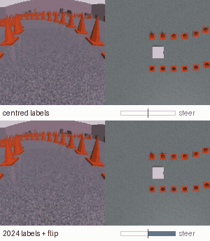
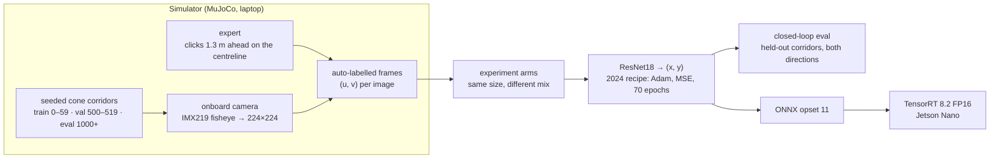
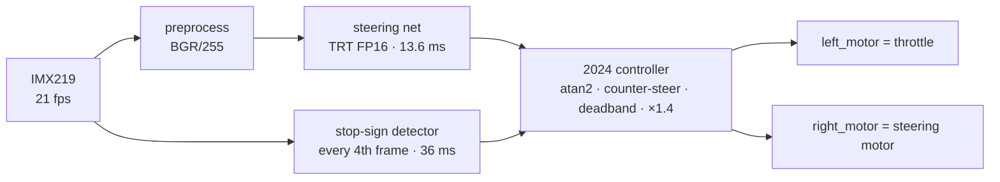
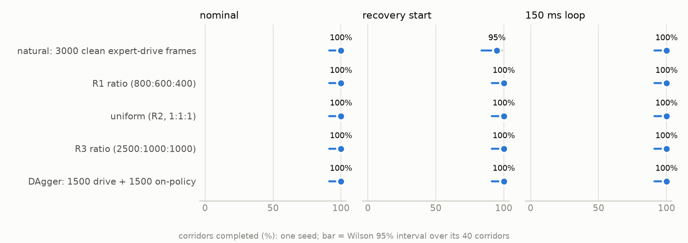
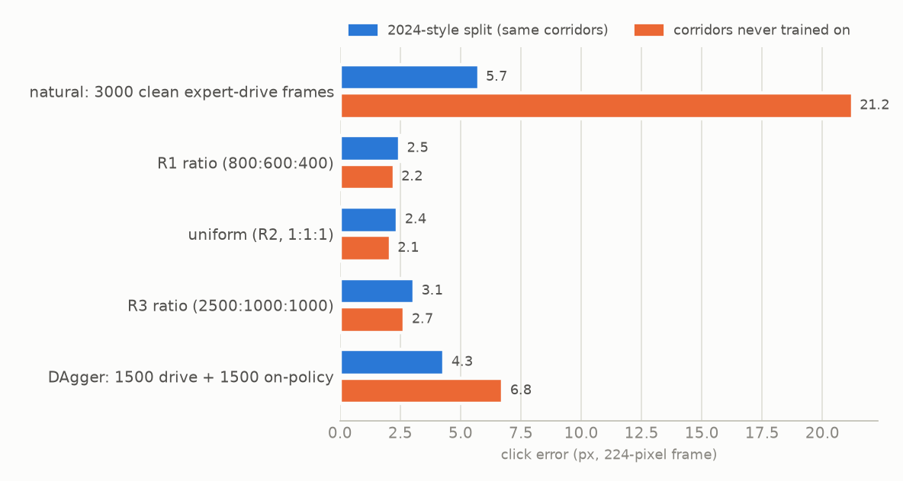
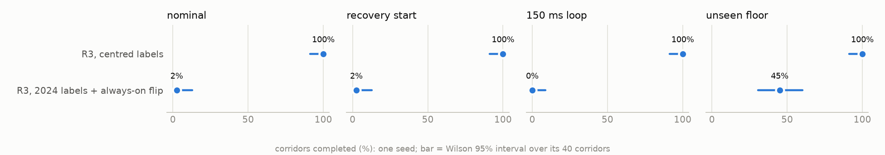

# JetBot driving policy: rebuilt, measured, and the label code it hinged on

In 2024 my kid and I built a self-driving ride-on car. A JetBot (Jetson Nano, IMX219 camera)
wired into a kids' car, a ResNet18 that looks at the camera and predicts where to steer, and
a YOLOv5 stop-sign detector as the safety stop. It took three rounds of re-collecting data
before it drove the hallway course ([original repo](https://github.com/daisyKim12/autonomous_driving)).

The images and weights didn't survive. This repository rebuilds the system: a simulator
matched to the 2024 camera frames, the same model and training recipe, and the 2024
controller ported line for line. It re-runs the three data rounds as a controlled experiment
and deploys the models on the same Jetson Nano. The question is the one the original
couldn't answer: what actually made it drive?



*Same held-out corridor, same round-3 frames, 2× speed. Top: centred labels. Bottom: the
2024 label pipeline. The bar is the steering command sent to the steering motor.*

<!-- BEGIN:headline -->
- **The label code, not the data mix, decides whether it drives (in simulation).** The same 4,500 round-3 frames complete 40/40 unseen corridors with centred labels and 1/40 with the 2024 label pipeline, every failure off the right side, steering pinned at full lock 96% of the time (18/40 on a floor the network had never seen). The real 2024 car drove smoothly on that pipeline, so this is a simulator prediction to test on the car, not a verdict on 2024.
- **Every data mix drives once the labels are right.** R1, uniform and R3 ratios, clean drives and DAgger all complete 40/40 unseen corridors. The mix only shows at the margins: trained on clean drives alone, the net misses 2/40 starts from off-centre and weaves 10× more than the best mix.
- **The 2024 validation split would have hidden it.** Trained only on clean drives, the net scores 5.7 px on a random 10% of its own corridors and 21.2 px on corridors it never saw.
- **The stop-sign data teaches nothing about what isn't a sign.** Retrained with the 2024 recipe, the detector boxes ~97% of the frame on 12/12 real 2024 frames that contain no sign. (The 2024 car's own detector worked; its weights are gone.)
- **On the same Jetson Nano: 6.7 → 21.0 fps.** The 2024 setting (detector at 640, FP32, every frame) takes 143 ms per decision even on TensorRT; FP16, a 320 input and a detector every 4th frame bring it to 14.6 ms, so the camera becomes the limit.
<!-- END:headline -->

Everything above is from one training seed per arm, scored on 20 corridors that were never
used for training, each driven in both directions (40 episodes). The intervals are Wilson
95% intervals over those 40.

## The system



On the car, every camera frame goes through the same path the 2024 notebook used:



| Piece | Where |
|---|---|
| Corridors, fisheye camera, car, expert | `jdp/track.py`, `jdp/camera.py`, `jdp/car.py`, `jdp/expert.py`, `jdp/scene.py` |
| The 2024 controller, verbatim | `jdp/controller.py` (tested against the notebook cell) |
| The 2024 data pipeline and the experiment arms | `jdp/data.py`, `jdp/labels.py` |
| Train / closed-loop eval / DAgger | `scripts/train.py`, `scripts/eval.py`, `scripts/dagger.py` |
| On the Nano: TensorRT runner, live camera loop, benchmarks | `nano/` |
| What is matched to the car and what is a guess | [docs/SIM_TO_REAL.md](docs/SIM_TO_REAL.md) |

## What the 2024 code did

The full reading is in [docs/ORIGINAL_2024.md](docs/ORIGINAL_2024.md). The short version:
- The steering labels were normalised as `(px − 50)/50` on a 224-pixel image, a leftover
  from an older NVIDIA example, so the centre of the frame read as a hard right.
- A horizontal-flip augmentation that was switched off in the constructor ran on every
  sample anyway and negated those off-centre labels.

Before any learning, here is what the label conventions do with **perfect** clicks, driven
through the verbatim 2024 controller:

<!-- BEGIN:baselines -->
| Clicks (no learning) | Complete [Wilson 95%] | Steer saturated | Weave /m | Failures |
|---|---|---|---|---|
| perfect clicks, centred labels `(px−112)/112` | 40/40 [91%–100%] | 0% | 0.025 | — |
| perfect clicks, 2024 labels `(px−50)/50` | 9/40 [12%–38%] | 95% | 0.000 | 31 off right |
| what a perfect 2024 net learns under the buggy flip | 40/40 [91%–100%] | 94% | 0.147 | — |
| always (0, 0): floor | 0/40 [0%–9%] | 0% | 0.000 | 17 off left, 23 off right |
<!-- END:baselines -->

Whether the flip rescues the offset depends on whether the network can tell a mirrored
frame from a real one. If it can't, it averages the two targets and the offset cancels. If
it can, the offset stays.

## The experiment

Each arm is 3,000 frames sampled from one pool, so only the mix changes. The frames are
snapshots at poses scattered around the centreline, the way the 2024 frames were taken
(place the car, click where it should steer). Each one is labelled by an expert that clicks
the centreline 1.3 m ahead. The exceptions are `natural`, which uses clean expert drives
only, and DAgger, which is half those drives and half frames from the `natural` policy's
own drives, relabelled by the expert. Every arm uses the 2024 recipe and the 2024 controller.

Three test conditions:
- **nominal:** start on the centreline.
- **recovery start:** start 0.35 m off-centre, pointed 15° further out.
- **150 ms loop:** the network acts on every 3rd frame and its command lands 150 ms later.
  That's what the Nano measures for the 2024 setting, below.

<!-- BEGIN:arms -->
| Arm | Frames | Held-out click error | 2024-style test error | Complete, nominal | Complete, recovery start | Complete, 150 ms loop | Weave /m (nominal) | Failures (all conditions) |
|---|---|---|---|---|---|---|---|---|
| natural: 3000 clean expert-drive frames | 3000 | 21.2 px | 5.7 px | 40/40 [91%–100%] | 38/40 [83%–99%] | 40/40 [91%–100%] | 0.086 | 1 off left, 1 off right |
| R1 ratio (800:600:400) | 3000 | 2.2 px | 2.5 px | 40/40 [91%–100%] | 40/40 [91%–100%] | 40/40 [91%–100%] | 0.009 | — |
| uniform (R2, 1:1:1) | 3000 | 2.1 px | 2.4 px | 40/40 [91%–100%] | 40/40 [91%–100%] | 40/40 [91%–100%] | 0.018 | — |
| R3 ratio (2500:1000:1000) | 3000 | 2.7 px | 3.1 px | 40/40 [91%–100%] | 40/40 [91%–100%] | 40/40 [91%–100%] | 0.031 | — |
| DAgger: 1500 drive + 1500 on-policy | 3000 | 6.8 px | 4.3 px | 40/40 [91%–100%] | 40/40 [91%–100%] | 40/40 [91%–100%] | 0.043 | — |
<!-- END:arms -->

<picture><source media="(prefers-color-scheme: dark)" srcset="assets/fig_arms_dark.png"></picture>

The literal 2024 rounds, nested the way the data was added. R2 is the uniform arm above,
frame for frame.

<!-- BEGIN:history -->
| Arm | Frames | Held-out click error | 2024-style test error | Complete, nominal | Complete, recovery start | Complete, 150 ms loop | Weave /m (nominal) | Failures (all conditions) |
|---|---|---|---|---|---|---|---|---|
| R1: 1800 frames (800/600/400) | 1800 | 2.6 px | 2.5 px | 40/40 [91%–100%] | 40/40 [91%–100%] | 40/40 [91%–100%] | 0.013 | — |
| R2: 3000 frames (1000/1000/1000) | 3000 | 2.1 px | 2.4 px | 40/40 [91%–100%] | 40/40 [91%–100%] | 40/40 [91%–100%] | 0.018 | — |
| R3: 4500 frames (2500/1000/1000) | 4500 | 2.5 px | 2.4 px | 40/40 [91%–100%] | 40/40 [91%–100%] | 40/40 [91%–100%] | 0.012 | — |
<!-- END:history -->

**The random split flatters a driving policy.** 2024 validated on a random 10% of its own
frames. Frames from the same corridor look alike, so that split can't see what goes wrong
on a corridor the network has never visited:

<picture><source media="(prefers-color-scheme: dark)" srcset="assets/fig_leakage_dark.png"></picture>

### Round 3, trained two ways

The same 4,500 round-3 frames, with the 2024 label pipeline and with centred labels. The
unseen-floor condition re-textures the floor with a speckle pattern the network never saw.

<!-- BEGIN:pair -->
| Arm | Frames | Held-out click error | 2024-style test error | Complete, nominal | Complete, recovery start | Complete, 150 ms loop | Complete, unseen floor | Weave /m (nominal) | Failures (all conditions) |
|---|---|---|---|---|---|---|---|---|---|
| R3, centred labels | 4500 | 2.2 px | 2.1 px | 40/40 [91%–100%] | 40/40 [91%–100%] | 40/40 [91%–100%] | 40/40 [91%–100%] | 0.026 | — |
| R3, 2024 labels + always-on flip | 4500 | 6.3 px | 6.1 px | 1/40 [0%–13%] | 1/40 [0%–13%] | 0/40 [0%–9%] | 18/40 [31%–60%] | 0.000 | 140 off right |
<!-- END:pair -->

<picture><source media="(prefers-color-scheme: dark)" srcset="assets/fig_pair_dark.png"></picture>

The network trained the 2024 way does not average away the offset. On real frames it outputs
the raw off-centre labels; on the same frames mirrored it outputs something else. It has
learned to tell a flipped training frame from a real one (`scripts/flip_check.py`):

<!-- BEGIN:flipcheck -->
| Bug-faithful net, trained on | Mean x on real frames | Mean x on the same frames mirrored | Distance to raw 2024 label | Distance to the flip-average |
|---|---|---|---|---|
| renderer v1 (pyrDown anti-aliasing) | +1.36 | -0.65 | 0.12 | 1.31 |
| renderer v2 (mirror-symmetric) | +1.37 | -0.29 | 0.12 | 1.32 |
<!-- END:flipcheck -->

**What went wrong on the way.** The first run of this pair (renderer v1) came out at 2/40,
and the flip check showed the network separating real from mirrored frames. The cause was
my renderer. The fisheye anti-aliasing used `cv2.pyrDown`, which centres its taps on even
pixels, so it doesn't commute with a horizontal mirror. Every frame had a half-pixel
handedness, and the network learned it. Renderer v2 uses 2×2 box averages, and
`tests/test_core.py::test_fisheye_remap_is_mirror_symmetric` pins the fix. The pair above
is on v2.

The network still told mirrored frames apart, this time through the one speckle tile that
covers every training floor. On an unseen floor the cue is gone, and the same network
completes 18/40 instead of 1/40, still failing only to the right. The other arms are on
renderer v1. Their labels flip consistently, so a mirror cue changes nothing for them.

**The real car disagrees.** The real round-3 car drove smoothly. The simulator predicts the
2024 label pipeline should have pulled right with the steering saturated. At least one of
its guesses is wrong for this car: the steering actuator, the camera geometry that decides
where clicks land, or whether the real network could tell mirrored frames apart. The list
is in [docs/SIM_TO_REAL.md](docs/SIM_TO_REAL.md), and it is the next thing to measure on
the car.

## The safety stop

The 2024 detector is YOLOv5s fine-tuned on a Roboflow export of traffic-sign crops. The
median image is 49×49 px, and every box covers ≥ 92% of its image. Retrained with the 2024
recipe (it reproduces the 0.995 mAP50 on those crops), then tested on a 30 cm stop board
rendered 1–6 m ahead in the corridor, and on frames with no sign
(`scripts/probe_detector.py`):

<!-- BEGIN:detector -->
| Detector | Input | Channels | Stops, sign in view | Box on the sign | Reliable range (≥90%) | False stops, no sign |
|---|---|---|---|---|---|---|
| 2024 retrained | 224 | RGB | 100% | 0% | none | 100% |
| 2024 retrained | 224 | BGR | 100% | 0% | none | 100% |
| 2024 retrained | 320 | RGB | 100% | 0% | none | 100% |
| 2024 retrained | 320 | BGR | 100% | 0% | none | 100% |
| 2024 retrained | 640 | RGB | 100% | 0% | none | 100% |
| 2024 retrained **(2024 setting)** | 640 | BGR | 100% | 0% | none | 100% |
| coco yolov5s | 224 | RGB | 33% | 33% | 2.0 m | 0% |
| coco yolov5s | 224 | BGR | 18% | 18% | 1.5 m | 0% |
| coco yolov5s | 320 | RGB | 36% | 36% | 2.5 m | 0% |
| coco yolov5s | 320 | BGR | 26% | 26% | 1.5 m | 0% |
| coco yolov5s | 640 | RGB | 53% | 53% | 3.0 m | 0% |
| coco yolov5s | 640 | BGR | 34% | 34% | 1.5 m | 0% |

On real frames from the 2024 car, none of which contains a stop sign (`scripts/probe_real_frames.py`):

| Detector | Channels | Frames that would have stopped the car | Median box size | Median confidence |
|---|---|---|---|---|
| 2024 retrained | BGR | 12/12 | 97% of the frame | 0.96 |
| 2024 retrained | RGB | 12/12 | 97% of the frame | 0.96 |
| coco yolov5s | BGR | 0/12 | — | — |
| coco yolov5s | RGB | 0/12 | — | — |
<!-- END:detector -->

The retrain has learned "the whole frame is a stop sign", which would never let the car move.
The 2024 car's own detector worked, so the 2024 weights must have differed; that can't be
checked without them. Stock COCO YOLOv5s, with no fine-tuning, localises the board out to
2.5–3 m with no false stops. Feeding it BGR, as 2024 did, cuts that range to 1.5 m.

## On the Nano

Same Jetson Nano, JetPack 4.6.1, TensorRT 8.2. The engines are built from the ONNX files
exported here. The loop is `nano/loop.py --dry-run` on the live IMX219: it computes the motor
commands but never sends them. Latency runs from frame arrival to command, so it excludes the
ISP and motor response.

<!-- BEGIN:nano -->
| Engine | Precision | GPU compute median | p99 | Engine size |
|---|---|---|---|---|
| coco_320 | FP16 | 23.2 ms | 23.2 ms | 15.7 MB |
| coco_320 | FP32 | 34.1 ms | 34.2 ms | 35.0 MB |
| coco_640 | FP16 | 82.4 ms | 82.6 ms | 23.6 MB |
| coco_640 | FP32 | 120.1 ms | 120.4 ms | 44.5 MB |
| policy | FP16 | 12.3 ms | 12.3 ms | 45.5 MB |
| policy | FP32 | 19.5 ms | 19.7 ms | 90.8 MB |
| yolo2024_320 | FP16 | 19.4 ms | 19.5 ms | 15.3 MB |
| yolo2024_320 | FP32 | 30.0 ms | 30.1 ms | 34.2 MB |
| yolo2024_640 | FP16 | 67.7 ms | 67.9 ms | 23.2 MB |
| yolo2024_640 | FP32 | 104.1 ms | 104.6 ms | 43.7 MB |

_Clocks: pinned with jetson_clocks: GPU 921.6 MHz, CPU 1479 MHz, nvpmodel MAXN._

| Loop | FPS | Preprocess p50 | Policy p50 | Detector p50 | Frame-arrival → command p50 / p95 | Detector frames that stopped the car | RAM (system) |
|---|---|---|---|---|---|---|---|
| 2024 setting on TensorRT: policy FP32 + 2024 detector 640 FP32, BGR, every frame | 6.7 | 0.9 ms | 21.0 ms | 120.8 ms | 142.7 / 143.7 ms | 100% | 2311 MB |
| improved: policy FP16 + COCO detector 320 FP16, RGB, every 4th frame | 21.0 | 0.9 ms | 13.6 ms | 36.1 ms | 14.6 / 51.5 ms | 0% | 1938 MB |
| policy FP16 + COCO detector 320 FP16, RGB, every frame | 19.7 | 0.9 ms | 13.6 ms | 36.0 ms | 50.6 / 51.6 ms | 0% | 1953 MB |
| policy only, TRT FP16, cv2 preprocessing | 21.0 | 0.9 ms | 13.5 ms | — | 14.4 / 14.5 ms | — | 1909 MB |
| policy only, TRT FP16, numpy preprocessing | 21.0 | 1.1 ms | 13.6 ms | — | 14.7 / 14.8 ms | — | 1927 MB |
| policy only, TRT FP32 | 20.1 | 0.9 ms | 20.8 ms | — | 21.7 / 21.9 ms | — | 2181 MB |
<!-- END:nano -->

Two things only showed up when measured:
- **Clocks.** Unpinned, the GPU governor parks the Nano at 537.6 MHz, because the loop only
  keeps the GPU busy about 45% of each frame. Decisions then take 22.8 ms instead of 14.4 ms.
  Run `sudo jetson_clocks` before trusting any number (`results/nano/governor_unpinned.json`).
- **INT8 doesn't exist here.** The Nano is Maxwell (SM 5.3), with no DP4A. FP16 is the only
  lever.

## Reproduce

```bash
uv venv --python 3.12 .venv && uv pip install --python .venv/bin/python -r requirements.txt
.venv/bin/python -m pytest -q tests                       # controller, labels, camera, mirror symmetry
.venv/bin/python scripts/collect.py --out data/pool          # ~65k frames, ~5 min on an M-series Mac
bash scripts/sweep.sh                                        # arms x seeds: train + closed-loop eval
bash scripts/hard_eval.sh                                    # recovery-start and 150 ms-loop conditions
# the round-3 pair on renderer v2: new pool, then both label pipelines on identical frames
.venv/bin/python scripts/collect.py --out data/pool_v2
.venv/bin/python scripts/train.py --arm hist_r3     --seed 0 --pool data/pool_v2 --name hist_r3_v2
.venv/bin/python scripts/train.py --arm hist_r3_bug --seed 0 --pool data/pool_v2 --name hist_r3_bug_v2
.venv/bin/python scripts/make_figures.py                     # every table and figure in this README

# detector (YOLOv5 is AGPL-3.0 and lives in its own venv, not vendored)
git clone https://github.com/ultralytics/yolov5 third_party/yolov5
uv venv --python 3.12 third_party/.venv-yolo && uv pip install --python third_party/.venv-yolo/bin/python -r third_party/yolov5/requirements.txt scikit-learn onnxslim
third_party/.venv-yolo/bin/python scripts/train_detector.py   # needs the 2024 set in data/stop2024 (see NOTICE)

# Nano (JetPack 4.6, no pip installs needed)
scp results/onnx/*.onnx nano/*.py nano/bench.sh jdp/controller.py nano:~/jdp/
ssh nano 'sudo jetson_clocks; cd ~/jdp && bash bench.sh ~/jdp/policy.onnx policy'
```

One seed per arm on an M5 MacBook takes about 21 minutes of training each, at $0. More seeds
are one environment variable away (`SEEDS="0 1 2" bash scripts/sweep.sh`).

## Credits

Built with my kid; the 2024 car is at
[daisyKim12/autonomous_driving](https://github.com/daisyKim12/autonomous_driving). Third-party
code and data are listed in [NOTICE](NOTICE). Licensed AGPL-3.0, because the detector is
YOLOv5.
