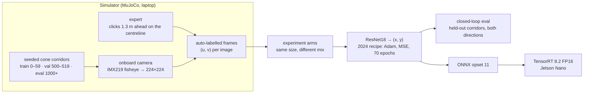
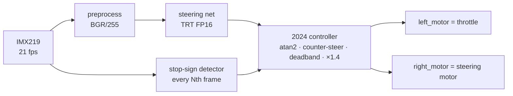

# JetBot driving policy: rebuilt, measured, and the bug that made it drive

In 2023–24 my kid and I built a self-driving ride-on car: a JetBot (Jetson Nano, IMX219
camera) wired into a kids' car, a ResNet18 that looks at the camera and predicts where to
steer, and a YOLOv5 stop-sign detector as the safety stop. It took three rounds of
re-collecting data before it drove the hallway course
([original repo](https://github.com/daisyKim12/autonomous_driving)).

The images and weights didn't survive. This repository rebuilds the whole system (a
simulator matched to the 2024 camera frames, the same model, the same training recipe,
the 2024 controller ported line for line) and deploys it on the same Jetson Nano. Then it
asks the question the original never could: **what actually made it drive?**

<!-- BEGIN:headline -->
<!-- END:headline -->

## The system



On the car, every camera frame goes through the same path the 2024 notebook used:



## What the 2024 code did

The full line-by-line reading is in [docs/ORIGINAL_2024.md](docs/ORIGINAL_2024.md). The short
version: the steering labels were normalised as `(px − 50)/50` on a 224-pixel image (a
leftover from an older NVIDIA example), and a horizontal-flip augmentation that was
switched off in the constructor ran on every sample anyway, negating those off-centre
labels. Before any learning, here is what those conventions do with **perfect** clicks,
driven through the verbatim 2024 controller on 20 unseen corridors in both directions:

<!-- BEGIN:baselines -->
<!-- END:baselines -->

## The experiment

<!-- BEGIN:arms -->
<!-- END:arms -->

<!-- BEGIN:history -->
<!-- END:history -->

## The safety stop

<!-- BEGIN:detector -->
<!-- END:detector -->

## On the Nano

<!-- BEGIN:nano -->
<!-- END:nano -->

## Reproduce

```bash
uv venv --python 3.12 .venv && uv pip install --python .venv/bin/python -r requirements.txt
.venv/bin/python -m pytest -q tests                       # controller, labels, camera, track
.venv/bin/python scripts/collect.py --out data/pool         # ~65k frames, ~5 min on an M-series Mac
bash scripts/sweep.sh                                       # all arms x 3 seeds, train + closed-loop eval
.venv/bin/python scripts/make_figures.py                    # every table and figure in this README
```

## Credits

Built with my kid; the 2023–24 car is at
[daisyKim12/autonomous_driving](https://github.com/daisyKim12/autonomous_driving). Third-party
code and data are listed in [NOTICE](NOTICE). Licensed AGPL-3.0, because the detector is
YOLOv5.
