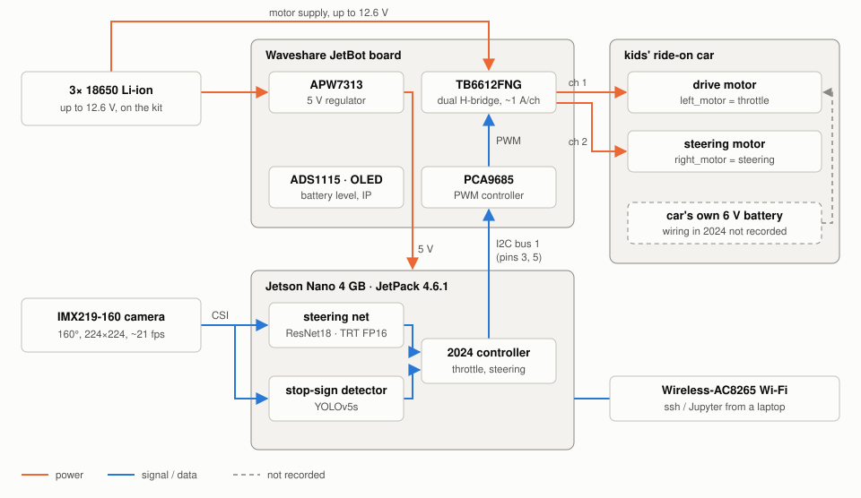
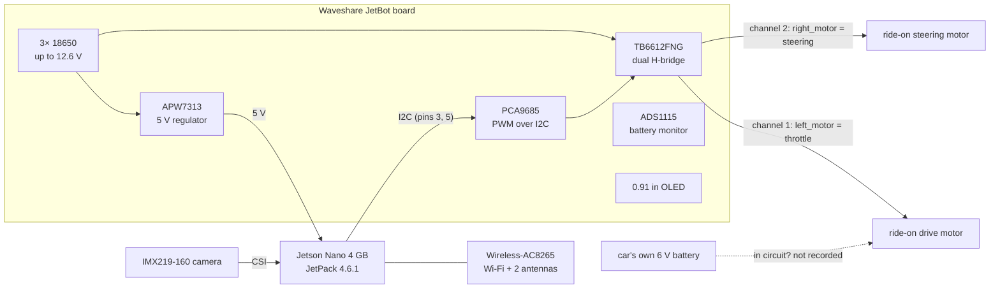

# Hardware

The car as built in 2024, the gear to measure what the simulator guesses, and where the
hardware goes next.

The code drives both car motors through `jetbot.Robot`, which writes to the PCA9685 and the
TB6612FNG on the JetBot board (`rf_live_detection.ipynb`: `robot.left_motor` is throttle,
`robot.right_motor` is steering). The 2024 notes don't record how the car's own 6 V battery
and controller were wired around it.

## As built in 2024

How each line is known: **photo** = visible in the 2024 setup photos
(`docs/original_2024/`), **code** = implied by the 2024 notebooks, **kit** = in the
[Waveshare JetBot AI Kit](https://www.waveshare.com/jetbot-ai-kit.htm) spec, **measured** =
checked on the hardware today, **builders** = what we remember.

| Part | Role | Known from |
|---|---|---|
| NVIDIA Jetson Nano Developer Kit, 4 GB (Tegra X1, 128-core Maxwell) | runs camera, steering net, detector, controller | measured (3.9 GB RAM, `jetson-nano`), photo |
| 64 GB microSD | JetPack 4.6.1 (L4T R32.7.1), reflashed 2026 | measured (59 GB root partition), kit |
| IMX219-160 camera, 8 MP, 160° diagonal FOV | the policy's only sensor, 224×224 at ~21 fps | measured (`imx219` on CSI), kit, builders |
| Waveshare JetBot AI Kit: chassis, expansion board, 4010 fan | carries the Nano; board holds driver, PWM, regulator | photo, builders |
| JetBot board: TB6612FNG dual H-bridge | drives the two car motors | kit, code |
| JetBot board: PCA9685 PWM controller (I2C) | sets motor speed and direction from the Nano | kit, code (`jetbot.Robot`) |
| JetBot board: APW7313 regulator | 5 V to the Nano from the battery pack | kit |
| JetBot board: ADS1115 + 0.91" OLED | battery voltage, IP address on screen | kit |
| 3× 18650 Li-ion cells, up to 12.6 V (protection is on the board) | powers Nano and motor driver | kit (cells not included in the kit) |
| Wireless-AC8265 Wi-Fi/BT card + 2 antennas | Jupyter over Wi-Fi in 2024, as the 2024 README describes | photo (antennas), kit |
| Kids' electric ride-on car (white), 6 V battery | the vehicle: one drive motor, one steering motor | photo, builders |
| Orange traffic cones, ~0.6 m apart | the corridor course | photo (camera frames) |
| Printed stop sign | target for the safety stop | 2024 README, builders |

**Check before driving it hard.** Pololu rates the TB6612FNG at about 1 A continuous and 3 A
peak per channel ([Pololu 713](https://www.pololu.com/product/713)). A ride-on drive motor
can draw well more than that, especially at stall. The board's motor supply is the 18650
pack, up to 12.6 V, about twice a 6 V motor's rating; at the 2024 throttle of 0.34 the
average is about 4.3 V. Measure the motor current before raising the throttle.

## Phase 6: test gear

Each item measures one guess in [SIM_TO_REAL.md](SIM_TO_REAL.md).

| Item | Measures | Replaces the guess |
|---|---|---|
| Printed checkerboard (e.g. 9×6 inner corners, 25 mm squares) on a rigid board | lens intrinsics and fisheye model (OpenCV `fisheye.calibrate`) | 110° effective FOV fitted by eye |
| Tape measure, angle finder | camera height and tilt, wheelbase | 0.40 m, 26°, 0.65 m |
| Phone with 240 fps slow-motion | steering step response: command ±1, film the front wheels | first-order lag, τ = 0.2 s, ±0.45 rad |
| 5 m of floor tape + stopwatch | speed at throttle 0.34 | 2.0 m/s per unit throttle |
| LED + 330 Ω resistor on a Nano GPIO pin, in the camera's view | glass-to-command latency (blink, find the frame that sees it) | the ISP/queue delay the loop can't time |
| Inline DC switch on motor power, blocks to lift the wheels | e-stop, and wheels-off-ground tests first | — |
| Clamp meter (DC) | drive and steering motor current | whether the TB6612FNG is in spec |

## Upgrade path

| Part | Why | Notes |
|---|---|---|
| NVIDIA Jetson Orin Nano Super Developer Kit (8 GB) | 67 INT8 TOPS, Ampere tensor cores with INT8, 8 GB; JetPack 6 instead of 4.6, so it leaves Python 3.6 and Maxwell behind | $249 ([NVIDIA announcement via TechPowerUp](https://www.techpowerup.com/329957/nvidia-unveils-new-jetson-orin-nano-super-developer-kit)); JetPack 6, so `nano/` needs a port from Python 3.6 |
| 2× VNH5019 motor driver carrier (one per motor) | 12 A continuous, 30 A peak, 5.5–24 V, 3.3 V logic ([Pololu 1451](https://www.pololu.com/product/1451)) | covers a 6 V lead-acid battery under load; PWM and direction from the existing PCA9685 |
| Potentiometer on the steering column | steering angle feedback, so the controller can close the loop | removes the biggest unknown in the simulator |
| Rigid camera mount | fixes height and tilt between runs | keeps the calibration valid |
